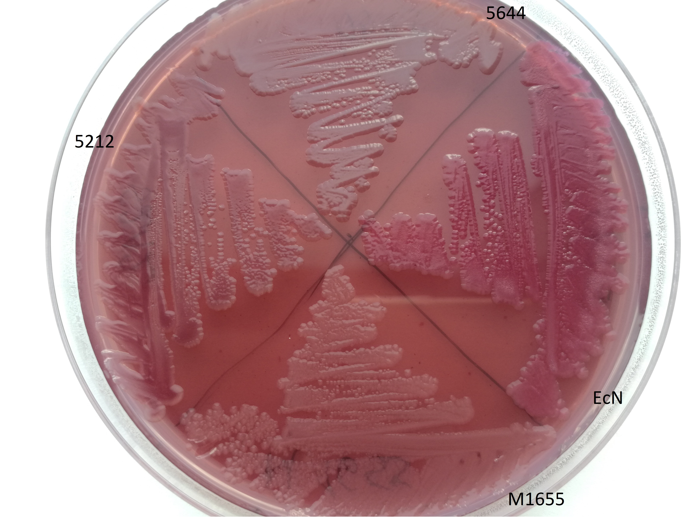
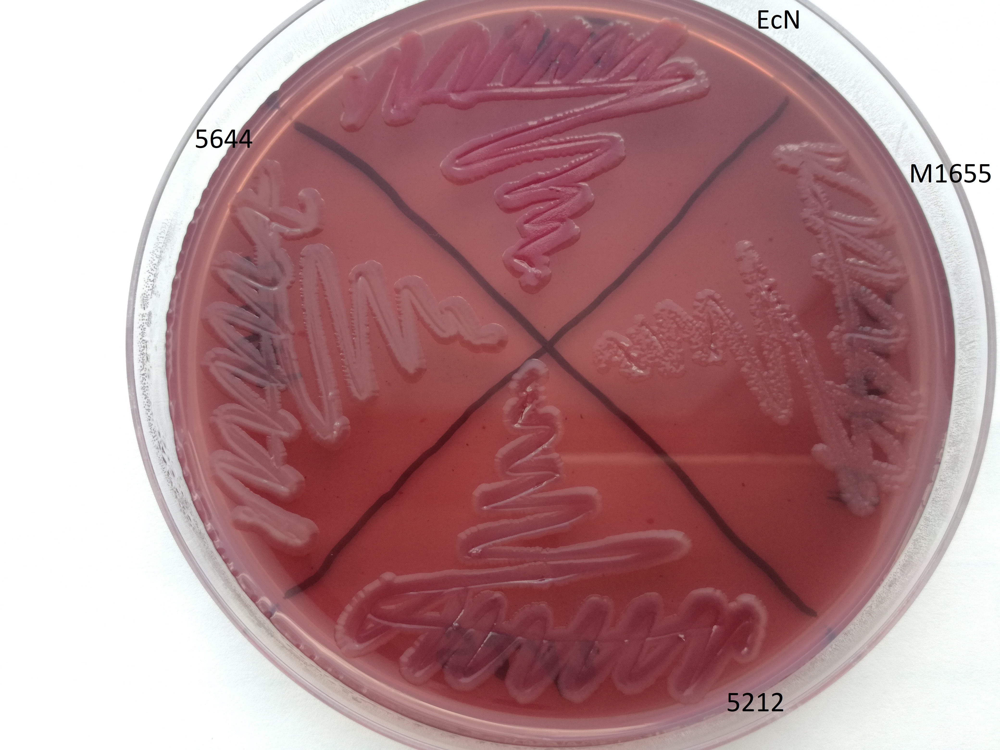
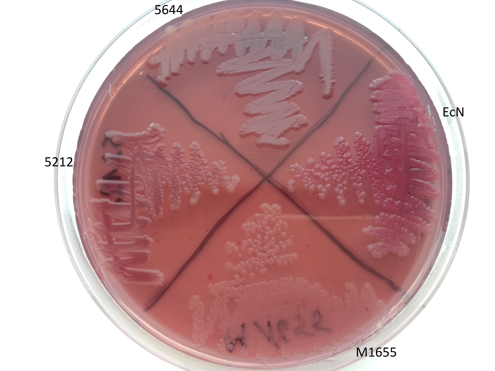
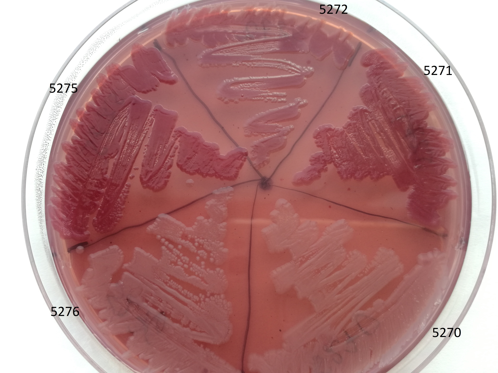
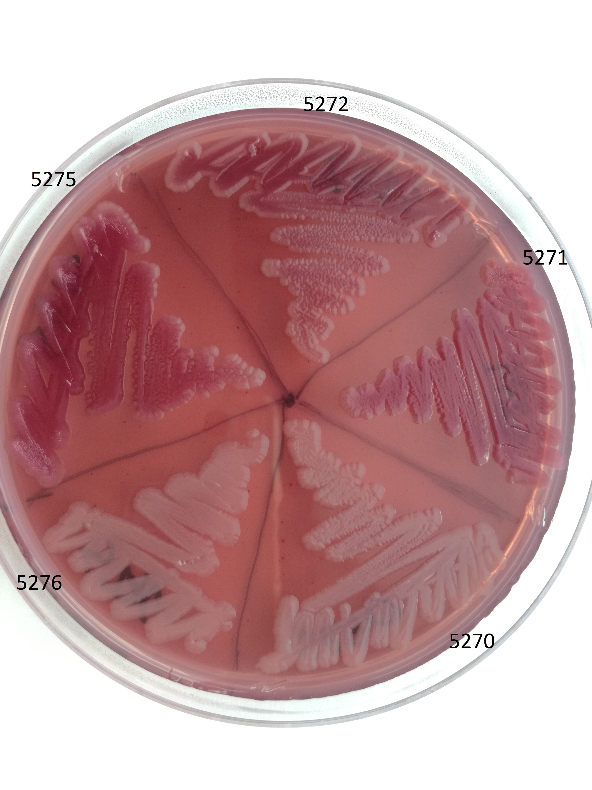
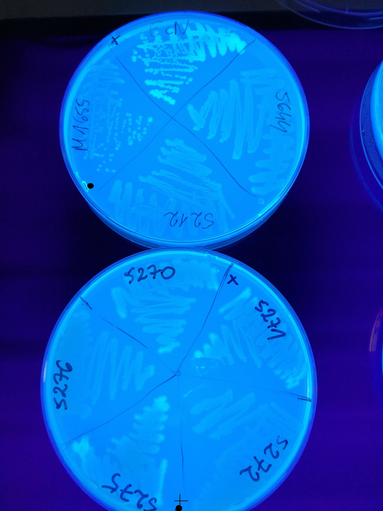
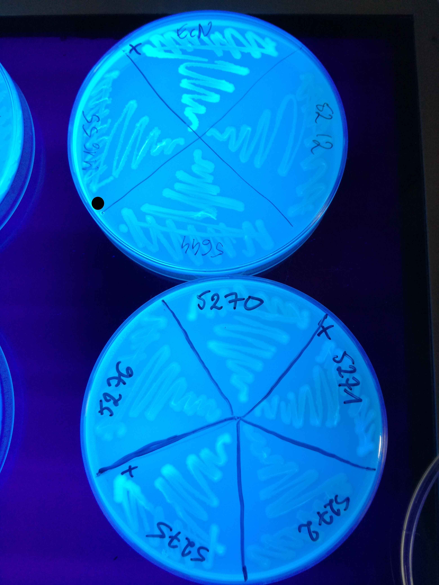
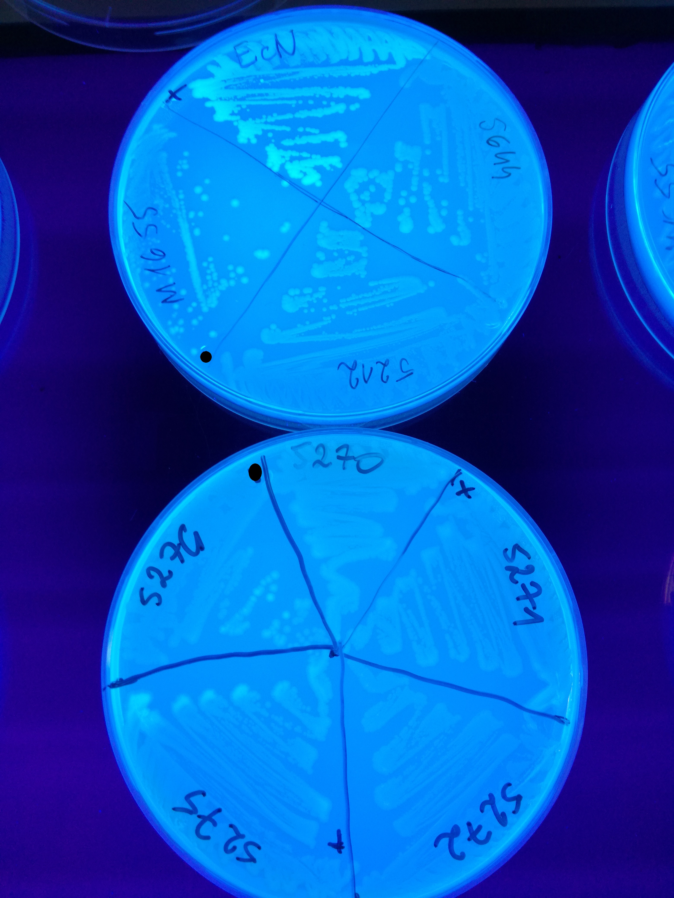

```{r setup, include=FALSE}
knitr::opts_chunk$set(echo = FALSE)
library(dplyr)
library(readODS)
library(reshape2)
library(ggplot2)
library(ggbeeswarm)
library(tidyverse)

read_cv <- function(cv_dir) {
  all_files <- list.files(cv_dir, full.names = TRUE)
  
  lapply(all_files, function(ith_file) {
    cv_data <- read_ods(ith_file, col_names = FALSE) %>%
    # cv_data <- read_ods("./CrystalViolet/2018-08-16-AL-S1-R1.ods", col_names = FALSE) %>%
      as.matrix
    
    colnames(cv_data) <- LETTERS[1L:12]
    
    mcv_data <- melt(cv_data, varnames = c("row", "col")) %>% 
      mutate(row = factor(row), 
             col = factor(col))
    
    experiment_metadata <- strsplit(ith_file, "/") %>% 
      unlist %>% 
      last %>% 
      strsplit(".", fixed = TRUE) %>%
      unlist %>% 
      first %>% 
      strsplit("-") %>% 
      unlist
    
    # experiment_date <- paste(experiment_metadata[1], experiment_metadata[2], experiment_metadata[3], sep = "-")
    
##### check if works correctly on more templates    
    scheme_name <- paste0("./CrystalViolet-scheme/", experiment_metadata[5], ".csv")
    
    plate_scheme <- read.csv(scheme_name, header = FALSE) %>% 
      as.matrix()
    colnames(plate_scheme) <- LETTERS[1L:12]
    mplate_scheme <- melt(plate_scheme, varnames = c("row", "col"), value.name = "description") %>% 
      mutate(row = factor(row), 
             col = factor(col))
    
    
    inner_join(mplate_scheme, mcv_data, by = c("row" = "row", "col" = "col")) %>% 
      filter(!is.na(description)) %>% 
      mutate(description = as.character(description), 
             strain = sapply(strsplit(description, split = "-"), first),
             medium = sapply(strsplit(description, split = "-"), last),
             experimentator = experiment_metadata[4],
             scheme = experiment_metadata[4],
             replicate = experiment_metadata[6],
             exp_date = paste(experiment_metadata[1], experiment_metadata[2], experiment_metadata[3], sep = "-"))  %>%
      select(strain, medium, experimentator, replicate, value, exp_date)
  }) %>%
    bind_rows()
}

res <- read_cv("./CrystalViolet")
```

## Overview

Created: 2018-08-04.

Parsed: `r Sys.Date()`.

## Aim 

Repeat experiments from Schiebel et al. (2017).

- Crystal Violet
- VideoScan

Learn how to extract medium solution in order to lose as few bacteria as possible.
Developing a reproducible extraction method.

## Materials

Strains used:

- 5270
- 5271
- 5272
- 5275
- 5276

The selected strains were used because they formed the strongest biofilms. 
In addition, we had a comparison with the figures from the publication.

## Methods

We compare results computing the correlation coefficient between results from Schiebel et al. (2017) and new measurements from 2018. Results are annotated as **R2017** and **R2018** respectively. 

In the case of a perfect reproduction of an experiment, the correlation coefficient should be 1. If both experiments are giving different results, the correlation coefficient is 0.

To account for normalization and baselining, we are using Spearman's correlation coefficient which relies on ranks instead of raw values.

## Crystal Violet (CV)

```{r}
ggplot(res, aes(x = strain, y = value, color = experimentator)) +
  geom_boxplot() +
  facet_wrap(~ medium) +
  theme_bw()
```

Red points represent medians.

## Crystal Violet (CV). Result by day.

```{r}
ggplot(res, aes(x = strain, y = value, color = experimentator)) +
  geom_boxplot() +
  facet_grid(cols = vars(medium), rows = vars(exp_date)) +
  theme_bw()
```

Red points represent medians.

## CV: medium. Quasirandom.

```{r}
ggplot(res, aes(x = strain, y = value, color = experimentator)) +
  geom_quasirandom() +
  facet_wrap(~ medium) +
  theme_bw()
```

## CV: medium. Result by day. Quasirandom.

```{r}
ggplot(res, aes(x = strain, y = value, color = experimentator)) +
  geom_quasirandom() +
  facet_grid(cols = vars(medium), rows = vars(exp_date)) +
  theme_bw()
```

## CV: median.

```{r}
group_by(res, strain, medium, experimentator, replicate) %>% 
  summarise(value = median(value)) %>% 
  ggplot(aes(x = strain, y = value, color = experimentator)) +
  geom_point(size = 3) +
  facet_wrap(~ medium) +
  theme_bw()
```

## CV: median. Result by day.

```{r}
group_by(res, strain, medium, experimentator, replicate, exp_date) %>% 
  summarise(value = median(value)) %>% 
  ggplot(aes(x = strain, y = value, color = experimentator)) +
  geom_point(size = 3) +
  facet_grid(cols = vars(medium), rows = vars(exp_date)) +
  theme_bw()
```

## Congo red (CR)

```{r,warning=FALSE}
cr_cf_dat <- read.csv("data/2018-08-17_CR_CF_format.csv", na.strings = TRUE)

cr <- select(cr_cf_dat, 1L:6) 
colnames(cr) <- c("strain", "pathotype", "Ania", "Dominika", "Joanna", "Jule")
cr <- select(cr, -pathotype)

cr_df <- cr %>% 
  # gather(key = "strain", value = c(Ania, Dominika, Joanna, Jule))
  # filter(Ania != "", Dominika != "", Joanna != "", Jule != "") %>% 
  select(Ania, Dominika, Joanna, Jule) %>% gather(key = "experimentator", value = "phenotype") %>% 
  cbind(cr) %>% 
  select(-Ania, -Dominika, -Joanna) %>% 
  mutate(concordance = as.character(phenotype) == as.character(Jule)) %>% 
  mutate(phenotype = factor(phenotype))


# Popracować nad wykresem
p <- ggplot(cr_df, aes(x = strain, y = experimentator, fill = phenotype, shape = concordance)) +
  geom_tile(color = "black") +
  geom_point(size = 4) +
  scale_x_discrete("Strain") +
  scale_y_discrete("Measurement date") +
  scale_fill_discrete("Phenotype") +
  scale_shape_manual("Concordance", values = c(NA, 16), guide = FALSE) +
  theme_bw()


p
```

Points denote experiments where results from 2017 and 2018 are in the agreement.

<!-- ## Congo red (CR) -->

<!-- ```{r,warning=FALSE} -->
<!-- p -->
<!-- ``` -->

Why there are no CR measurements for strains 5275 and 5276?

## CR (2017 and 2018)

<style>
.column-left1{
  float: left;
  width: 45%;
  text-align: left;
}

.column-right1{
  float: right;
  width: 45%;
  text-align: right;
}
</style>


<div class="column-left1">
R2018.
<br>

<br>
Improper streaking.
</div>

<div class="column-right1">
R2017
<br>

</div>


## CR2018

<div class="column-left1">

</div>

<div class="column-right1">

</div>

## CR2018

<div class="column-left1">

</div>

<div class="column-right1">

</div>


## Calcofluor

```{r,warning=FALSE}
cr_cf_dat <- read.csv("data/2018-08-17_CR_CF_format.csv")

cf <- select(cr_cf_dat, c(1, 7:10))
colnames(cf) <- c("strain", "Ania", "Dominika", "Joanna", "Jule")

cf_df <- cf %>% 
  # gather(key = "strain", value = c(Ania, Dominika, Joanna, Jule))
  # filter(Ania != "", Dominika != "", Joanna != "", Jule != "") %>% 
  select(Ania, Dominika, Joanna, Jule) %>% 
  gather(key = "experimentator", value = "result") %>% 
  cbind(cf) %>% 
  select(-Ania, -Dominika, -Joanna) %>% 
  mutate(concordance = as.character(result) == as.character(Jule)) %>% 
  mutate(result = factor(result))

ggplot(cf_df, aes(x = strain, y = experimentator, fill = result, shape = concordance)) +
  geom_tile(color = "black") +
  geom_point(size = 4) +
  scale_x_discrete("Strain") +
  scale_y_discrete("Measurement date") +
  scale_fill_discrete("Phenotype") +
  scale_shape_manual("Concordance", values = c(NA, 16), guide = FALSE) +
  theme_bw()

```

Points denote experiments where results from 2017 and 2018 are in the agreement.

## Calcofluor 2017 and 2018

<div class="column-left1">
R2018.
<br>

</div>

<div class="column-right1">
R2017
<br>

</div>

## CF2018

<div class="column-left1">

</div>

<!-- <div class="column-right1"> -->
<!--  -->
<!-- </div> -->

## Conclusions

1. Repeat experiments (each person separately performs the whole procedure: three replicates of VS and CV and only once CR and CF).
2. Improve quality of data: naming convention of files, put CV, CR and CF results in the electronic format in the dropbox repository.
3. Improve quality of streaking and photos.
