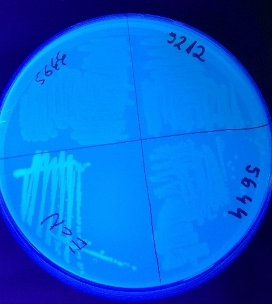

```{r setup, include=FALSE}
knitr::opts_chunk$set(echo = FALSE)
library(dplyr)
library(reshape2)
library(ggplot2)
library(magrittr)
library(ggbeeswarm)
library(knitr)


get_last_character <- function(x) {
  len_x <- nchar(x)
  substr(x, len_x, len_x)
}

raw_dat <- read.csv2("data/cv_and_videoscan.csv") %>% 
  mutate(strain = factor(strain)) %>% 
  melt(variable.name = "experiment") %>% 
  mutate(method = ifelse(grepl("CV", experiment), "CV", "Videoscan"),
         replicate = get_last_character(as.character(experiment)),
         medium = substr(experiment, 0, 3)) 


strains <- c("5270", "5271", "5272", "5275", "5276")

mediums <- c("LB10", "TSB", 
             "BHI", "M63")

absorbance <- c(0.204, 0.345, 0.251, 0.158, 0.141, 0.283, 
                0.202, 0.303, 0.522, 0.303, 0.183, 0.184, 
                0.791, 0.126, 0.186, 0.207, 0.219, 0.316, 
                0.22, 0.327, 0.46, 0.267, 0.202, 0.174, 
                0.195, 0.408, 0.611, 0.859, 0.872, 0.665, 
                0.29, 0.469, 0.679, 0.31, 0.265, 0.199, 
                0.44, 0.149, 0.172, 0.152, 0.189, 0.138, 
                0.185, 0.209, 0.206, 0.18, 0.168, 0.142, 
                0.032, 0.031, 0.031, 0.031, 0.032, 0.032, 
                0.146, 0.316, 0.243, 0.409, 0.189, 0.154)

absorbance <- matrix(absorbance, nrow = 6, ncol = 10)

rownames(absorbance) <- c("B", "C", "D", "E", "F", "G")
colnames(absorbance) <- seq(2,11)


CV2018 <- absorbance %>% 
  t %>% 
  data.frame() %>% 
  slice((1L:5)*2 - 1) %>% 
  select(B, C, D) %>% 
  mutate(strain = c("5270", "5271", "5272", "5275", "5276"),
         method = "CV",
         date = "R2018") %>% 
  melt(variable.name = "replicate") %>% 
  mutate(replicate = as.character(as.numeric(replicate)))

CV_all <- bind_rows(select(raw_dat, strain, method, value, replicate) %>% 
                      filter(method == "CV", strain %in% c("5270", "5271", "5272", "5275", "5276")) %>% 
                      mutate(date = "R2017"),
                    CV2018)


CV_aggr <- group_by(CV_all, strain, date, replicate) %>% 
  summarise(value = median(value)) %>% 
  summarise(value = median(value)) %>% 
  dcast(strain ~ date)


# Michal - VS ---------------------------------------------


raw_vs_frame <- read.csv2("data/ProjektDevC003707-2018-07-26-Koza-Biofilm.csv", skip = 6, header = FALSE, stringsAsFactors = FALSE)
# raw_vs_frame <- read.csv2("data/ProjektDevC003709-2018-07-27-Ania-Biofilm.csv", skip = 6, header = FALSE, stringsAsFactors = FALSE)

vs_frame <- rbind(raw_vs_frame$V14)
colnames(vs_frame) <- rbind(raw_vs_frame$V3)
vs_frame <- matrix(vs_frame)
vs_frame <- matrix(data = vs_frame, nrow = 8, ncol = 12)
rownames(vs_frame) <- c("A", "B", "C", "D", "E", "F", "G", "H")
colnames(vs_frame) <- seq(1,12)

vs_frame <- vs_frame[-c(1,8), -c(1,12)]
vs_frame <- matrix(vs_frame,nrow = 3, ncol = 20)
colnames(vs_frame) <- rep(mediums, 5)

raw_vs <- vs_frame

colnames(raw_vs) <- paste0(colnames(raw_vs), "_", c("5270", "5271", "5272", "5275", "5276") %>% lapply(rep, 4) %>% unlist)

VS_all <- bind_rows(select(raw_dat, strain, method, value, replicate, medium) %>% 
                      filter(method == "Videoscan", strain %in% c("5270", "5271", "5272", "5275", "5276")) %>% 
                      mutate(date = "R2017"),
                    melt(raw_vs) %>% 
                      rename(replicate = Var1) %>% 
                      mutate(medium = sapply(strsplit(as.character(Var2), split = "_"), first),
                             strain = sapply(strsplit(as.character(Var2), split = "_"), last),
                             replicate = as.character(replicate)) %>% 
                      select(-Var2) %>% 
                      mutate(medium = ifelse(medium == "LB10", "LB_", medium),
                             date = "R2018",
                             method = "Videoscan"))

VS_aggr <- group_by(VS_all, strain, medium, date, replicate) %>% 
  summarise(value = median(value)) %>% 
  summarise(value = median(value)) %>% 
  dcast(strain + medium ~ date)

# raw_vs_frame <- read.csv2("data/ProjektDevC003707-2018-07-26-Koza-Biofilm.csv", skip = 6, header = FALSE, stringsAsFactors = FALSE)
raw_vs_frame1 <- read.csv2("data/ProjektDevC003709-2018-07-27-Ania-Biofilm.csv", skip = 6, header = FALSE, stringsAsFactors = FALSE)

vs_frame1 <- rbind(raw_vs_frame1$V14)
colnames(vs_frame1) <- rbind(raw_vs_frame1$V3)
vs_frame1 <- matrix(vs_frame1)
vs_frame1 <- matrix(data = vs_frame1, nrow = 8, ncol = 12)
rownames(vs_frame1) <- c("A", "B", "C", "D", "E", "F", "G", "H")
colnames(vs_frame1) <- seq(1,12)

vs_frame1 <- vs_frame1[-c(1,8), -c(1,12)]
vs_frame1 <- matrix(vs_frame1,nrow = 3, ncol = 20)
colnames(vs_frame1) <- rep(mediums, 5)

raw_vs1 <- vs_frame1

colnames(raw_vs1) <- paste0(colnames(raw_vs1), "_", c("5270", "5271", "5272", "5275", "5276") %>% lapply(rep, 4) %>% unlist)

VS_all1 <- bind_rows(select(raw_dat, strain, method, value, replicate, medium) %>% 
                      filter(method == "Videoscan", strain %in% c("5270", "5271", "5272", "5275", "5276")) %>% 
                      mutate(date = "R2017"),
                    melt(raw_vs1) %>% 
                      rename(replicate = Var1) %>% 
                      mutate(medium = sapply(strsplit(as.character(Var2), split = "_"), first),
                             strain = sapply(strsplit(as.character(Var2), split = "_"), last),
                             replicate = as.character(replicate)) %>% 
                      select(-Var2) %>% 
                      mutate(medium = ifelse(medium == "LB10", "LB_", medium),
                             date = "R2018",
                             method = "Videoscan"))

VS_aggr1 <- group_by(VS_all1, strain, medium, date, replicate) %>% 
  summarise(value = median(value)) %>% 
  summarise(value = median(value)) %>% 
  dcast(strain + medium ~ date)
```

## Overview

Created: 2018-08-04.

Parsed: `r Sys.Date()`.

## Aim 

Repeat experiments from Schiebel et al. (2017).

- Congo Red
- Calcofluor
- Crystal Violet
- VideoScan

## Materials

Strains used: 

- E. coli MG 1655
- 1917 Nissle (EcN)
- 5212
- 5270
- 5271
- 5272
- 5275
- 5276
- 5644

## Methods

We compare results computing the correlation coefficient between results from Schiebel et al. (2017) and new measurements from 2018. Results are annotated as **R2017** and **R2018** respectively. 

In the case of a perfect reproduction of an experiment, the correlation coefficient should be 1. If both experiments are giving different results, the correlation coefficient is 0.

To account for normalization and baselining, we are using Spearman's correlation coefficient which relies on ranks instead of raw values.

## Crystal Violet (CV)

```{r}
ggplot(CV_all, aes(x = date, y = value)) +
  geom_quasirandom() +
  geom_point(data = group_by(CV_all, date, strain) %>% summarize(median_val = median(value)),
             aes(x = date, y = median_val), color = "red") +
  facet_wrap(~ strain) +
  theme_bw()
```

Red points represent medians.

## CV: Pearson's correlation

```{r}
ggplot(CV_aggr, aes(x = R2017, y = R2018, color = strain)) +
  geom_point(size = 4) +
  #geom_smooth(method = "lm", color = "black", formula = y ~ x) +
  theme_bw()
```


Pearson's correlation: `r CV_aggr %$% cor(R2017, R2018, method = "pearson") %>% round(2)`.

## CV: Spearman's correlation

```{r}
ggplot(CV_aggr, aes(x = rank(R2017), y = rank(R2018), color = strain)) +
  geom_point(size = 4) +
  geom_abline(slope = 1, intercept = 0) +
  theme_bw() +
  scale_x_continuous("R2017 (rank)") +
  scale_y_continuous("R2018 (rank)")
```

Spearman's correlation (normalization  independent): `r CV_aggr %$% cor(R2017, R2018, method = "spearman") %>% round(2)`.

## VideoScan 24 hours

Filename: **ProjektDevC003707-2018-07-26-Koza-Biofilm.csv**.

```{r}
ggplot(VS_all, aes(x = date, y = value)) +
  geom_quasirandom() +
  geom_point(data = group_by(VS_all, date, medium, strain) %>% summarize(median_val = median(value)),
             aes(x = date, y = median_val), color = "red") +
  facet_grid(medium ~ strain) +
  theme_bw()
```

Red points represent medians.

## VS24: Pearson's correlation

<style>
.column-left{
  float: left;
  width: 60%;
  text-align: left;
}

.column-right{
  float: right;
  width: 20%;
  text-align: right;
}
</style>

<div class="column-left">
```{r}
ggplot(VS_aggr, aes(x = R2017, y = R2018, color = strain)) +
  geom_point(size = 4) +
  facet_wrap(~ medium) +
  theme_bw() 
```
</div>


<div class="column-right">
```{r}
group_by(VS_aggr, medium) %>% 
  summarise(cor_coef = cor(R2017, R2018, method = "pearson")) %>% 
  mutate(cor_coef = round(cor_coef, 2)) %>% 
  kable(format = "html", table.attr = "float='left';style='width:30%;'")
```
</div>

## VS24: Spearman's correlation

<div class="column-left">
```{r}
group_by(VS_aggr, medium) %>% 
  mutate(R2018 = rank(R2018), 
         R2017 = rank(R2017)) %>% 
  ggplot(aes(x = R2017, y = R2018, color = strain)) +
  geom_abline(slope = 1, intercept = 0) +
  geom_point(size = 4) +
  facet_wrap(~ medium) +
  theme_bw() 
```
</div>

<div class="column-right">
```{r}
group_by(VS_aggr, medium) %>% 
  summarise(rho = cor(R2017, R2018, method = "spearman")) %>% 
  mutate(rho = round(rho, 2)) %>% 
  kable(format = "html", table.attr = "float='left';style='width:30%;'")
```
</div>


## ANIA | species ~ medium comparison

```{r}
ggplot(VS_all1, aes(x = date, y = value)) +
  geom_point() +
  facet_grid(medium ~ strain)
```

## Correlation of the data

```{r}
ggplot(VS_aggr1, aes(x = R2017, y = R2018)) +
  geom_point() +
  facet_wrap(~ medium)
```

## Median of results grouped by strain

```{r}
group_by(VS_all1, strain, date, replicate) %>% 
  summarise(value = median(value)) %>% 
  summarise(value = median(value)) %>% 
  dcast(strain ~ date) %>% 
  kable()
```

## Spearman correlation, grouped by medium  and strain

```{r}
group_by(VS_aggr1, medium) %>% 
    summarise(rho = cor(R2017, R2018, method = "spearman")) %>% 
    kable()

group_by(VS_aggr1, strain) %>% 
    summarise(rho = cor(R2017, R2018, method = "spearman")) %>% 
    kable()
```

## Congo red assay and Calcofluor assay comparison

```{r}
read.csv("data/wynik.csv")
```

## Congo Red
<!-- | girls vs Jule -->
<!-- { height=50% } -->


## Congo Red


## CalcoFluor
<!-- | girls vs Jule -->



